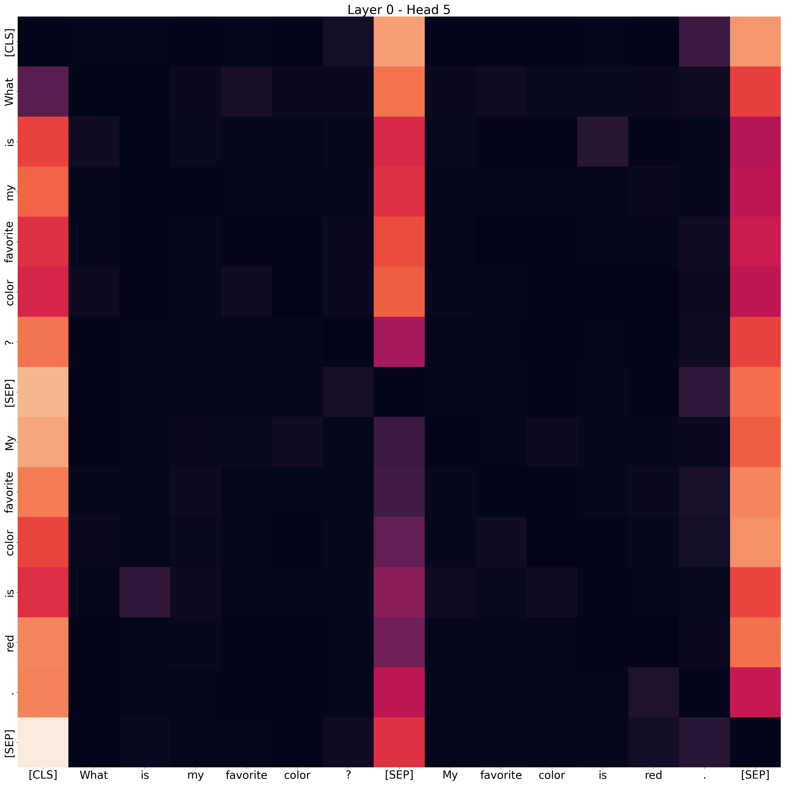
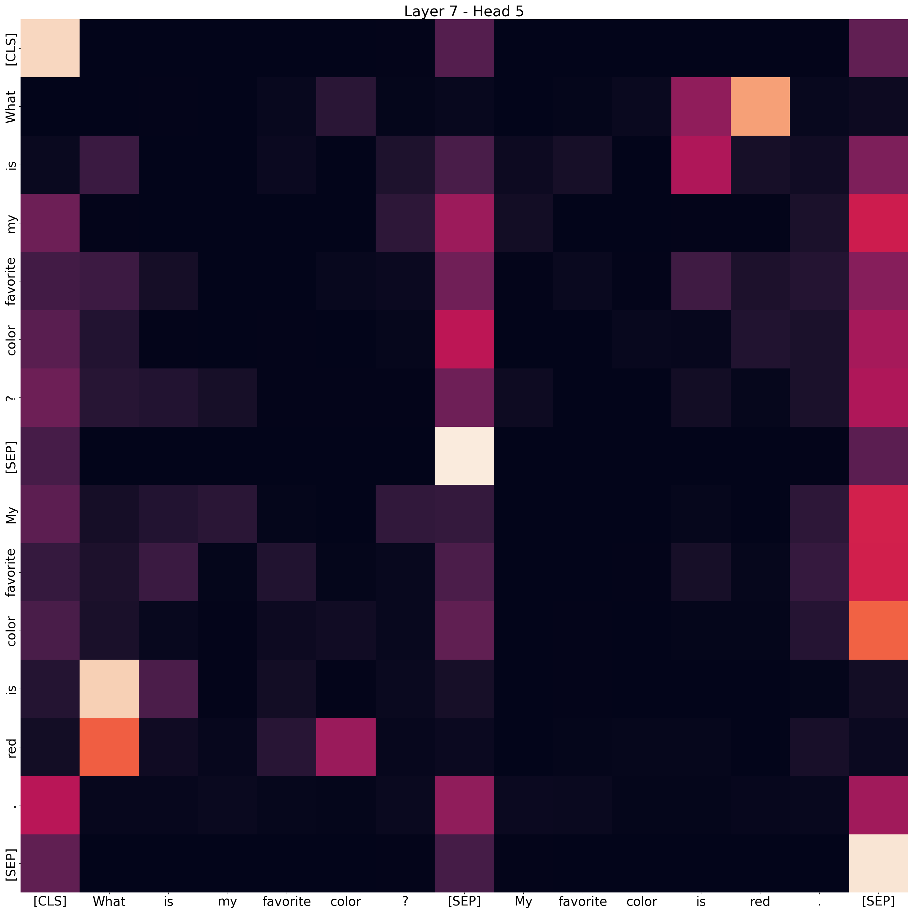

# Question Answering with DeBERTa and Attention Visualization

This project implements a question-answering system using Microsoft's DeBERTa model. It includes functionalities to train the model on the SQuAD dataset, analyze the attention mechanisms within the transformer layers, and visualize these attentions to gain insights into the model's focus during inference.

The way in which a model processes and understands langauge is crucial for understanding how these models work. In this project, an encoder transformer was pretrained to answer questions given some context. The folowing is a sample of the trained model's output:

*Question:* What is my favorite color?  
*Answer:* My favorite color is red.  

*Question:* What is my favorite color?  
*Model Answer*: red  
*Main Attended Token in Question:* What  

Below is a heatmap that visualizes the attention heads in layer 7. Note that Heads 4, 5, and 11 have attention from "What" in the y-axis to the "is" and "red" on the x-axis.  

## Table of Contents

- Features
- Usage
    - Training the Model
    - Analyzing Attention Layers
- Configuration
- Results
    - Attention Visualization
    - Performance Metrics
- Acknowledgements 

## Features
- **Data Loading and Preprocessing**: Efficiently load and preprocess the SQuAD dataset for training.
- **Model Training**: Train DeBERTa for question-answering tasks with support for early stopping and model checkpointing.
- **Attention Analysis**: Extract and analyze attention weights from the transformer layers.
- **Visualization**: Visualize attention heatmaps to understand which tokens (words) the model focuses on when generating answers to questions.
- **Interactive Interface**: Input custom questions and answers to see the model's attentions for each layer.

## Usage

1. Optionally edit the `config.yaml` file to set desired parameters if you wish to train the model. 
2. Run the training script `python run_experiment.py`. The program will ask you for an experiment name to run.
3. After training the model or loading in an old experiment, you can analyze and visualize the attention weights by running `python interactive_attention_analysis.py`
4. Enter a question and answer to that question with context.
5. Choose whether to visualize the attentions and which layers to view.
6. The model will the display the answer to the question and the word it pays the most attention to when providing the answer.

## Configuration

    model_name: 'microsoft/deberta-v3-base'
    epochs: 3
    learning_rate: 3e-5
    batch_size: 16
    max_length: 512
    stride: 128
    padding: 'longest'
    patience: 2
    best_model_path: 'models/experiment_1/best_model'

- model_name: Pretrained model to use.  
- epochs: Number of training epochs.  
- learning_rate: Learning rate for the optimizer.  
- batch_size: Batch size for training and validation.  
- max_length: Maximum sequence length for tokenization.  
- stride: Stride size for handling long sequences.  
- padding: Padding strategy ('longest', 'max_length', etc.).  
- patience: Patience for early stopping.  
- best_model_path: Directory to save the best model checkpoint.  

## Results

### Attention Visualization
The attention visualizations help in understanding which parts of the input the model focuses on when answering a question. For example, in Layer 7, we observe that the model attends heavily to certain keywords in the context that are crucial for generating the correct answer.

In this heatmap, darker colors represent higher attention weights. The model is focusing on tokens like "What", "is", and "red", indicating their importance in generating the answer. There is also significant attention paid to the '[SEP]` and stop tokens (e.g. '.', '?' in this case), showing that these tokens may be important in allowing the model to understand the semantics of the question and answer pair. 

What is also observed is that the heads in different layers are  not all layers are equal, as we only see attention paid to the answer tokens starting at layer 6. In the earlier layers, it can be seen that the model has several patterns that are likely used to understand the nature of the task. 

### Layer 0 - Head 5: Special Tokens Attention

In this visualization, we observe that in Layer 0, Head 5, the model's attention is predominantly focused on special tokens such as [CLS], [SEP], and punctuation marks. These tokens serve a crucial role in the model's understanding of the structure of the input sequence. The [CLS] token is often used to aggregate information across the entire input, while [SEP] is employed to separate distinct segments of text, such as the question and the context in a Q&A task. The heavy focus on these tokens indicates that the model is working to delineate the boundaries between different parts of the input, which is essential for correctly parsing the question and the context.

    

### Layer 0 - Head 10: Intra-Sentence Attention

In the same layer, Head 10 demonstrates another important pattern, where the tokens tend to focus on other tokens within the same sentence. For example, the token "What" in the question pays attention to the token "is." This type of attention helps the model maintain a coherent understanding of the relationships between words within a sentence. By focusing on the syntactic structure, the model can better understand how the words in the question relate to each other.

    

### Layer 3 - Head 11: Cross-Attention Between Question and Answer

As we move deeper into the model, we observe more complex attention patterns. In Layer 3, Head 11, the attention mechanism begins to establish connections between the tokens in the question and the tokens in the context or answer. This cross-attention is key for tasks like question-answering, where the model needs to correlate the information in the question with relevant portions of the context. In this visualization, the token "color" in the question attends to both "color" and "red" in the answer, indicating that the model is successfully identifying and linking related concepts across the question and the context.

    

### Layer 7 - Head 5: Focused Contextual Attention

In Layer 7, Head 5, the attention mechanism appears to be significantly more focused on key elements within the context and question. This head shows a strong concentration on the words "color," "is," and "red," which it uses for understanding and answering the question "What is my favorite color?". The attention paid to these words suggests that the model is actively trying to align the question with the relevant portion of the context to generate an accurate response.

 
     

### Performance Metrics
After training the model for 10 epochs, the model achieved the following performance on the validation set:

Validation Loss: 0.788  
Exact Match (EM): 64.8%  
F1 Score: 83.3%  
These metrics indicate the model's ability to predict the correct answer spans.  

## Acklowedgements
 - Preston Brown, without whom this project wouldn't be possible
 - Stanford Question and Answering Dataset
 - HuggingFace Transformers Library